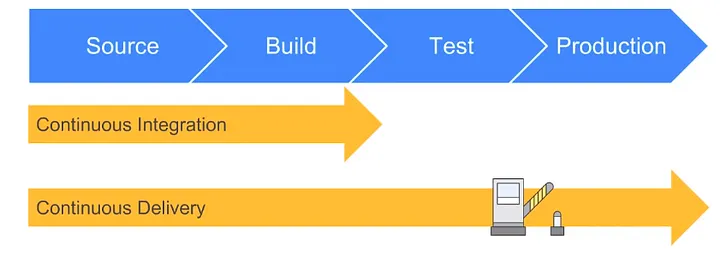
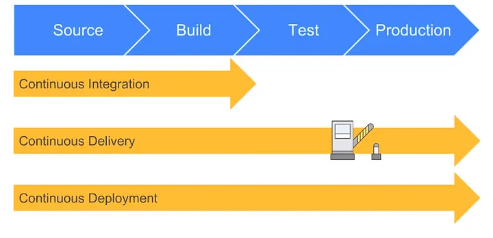

# CICD and Jenkins

## What is CI?

CI stands for Continuos Integration. This is is the concept of continuously commiting and merging changes as soon as they are ready rather than waiting until a specific time or date such as a pre-planned date.

We use fully automated build and test processes that can alert us to any issues that arise from our changes. 

Utilizing CI means we can avoid issues that could arise from all developers committing and pushing changes at the end of a project.



src = https://medium.com/@ahshahkhan/devops-culture-and-cicd-3761cfc62450

## What is CD?

### Continuos Delivery

Continuous Delivery is the concept of delivering new changes to the end users so that they can use the applications with the updated changes quicker. It's about releasing changes as soon as they are production ready.

Here we manually deploy the working changes once our automated build and test stages have passed.


https://medium.com/@ahshahkhan/devops-culture-and-cicd-3761cfc62450

### Continuos Deployment

Continuos Deployment goes one step further than Continuos Delivery as it is fully automated.

As soon as changes have passed the build and test stage, the changes are deployed. Only a failed test will prevent the automation process from being able to deploy our changes.

Here, we have no human interaction with the system at all.


## CICD Pipelines

Main purpose is to put working software into the hands of the users.

```
diagram to follow

```

- Advantages 
  - automation
  - saves time
  - saves money
  - ensure code quality
  
## What is Jenkins?

```
diagram to follow

```

Jenkins is an Open Sourced Java based program with packages for Windows, Linux and macOS. It is an automation server where the initial build and Continuos Integration process takes place.

## Why Jenkins?

Jenkins is used by major organizations such as Facebook, Netflix and Ebay and offers some great advantages:

- Advantages
  - Powerful range of plugins
  - Open-Source
  - Free
  - Industry Standard tool.


